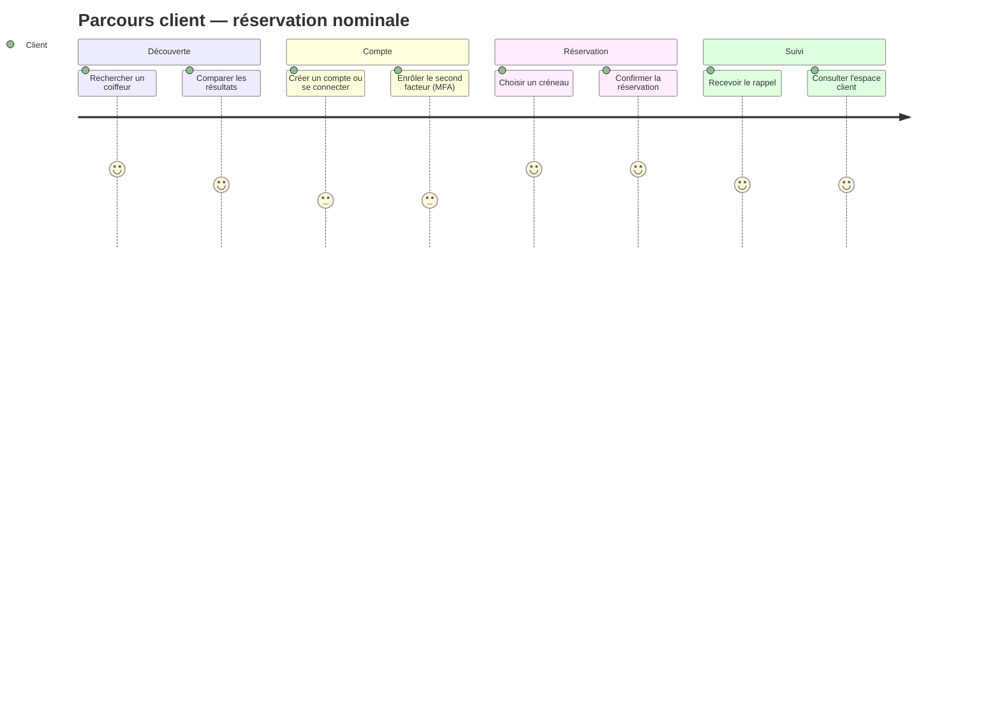
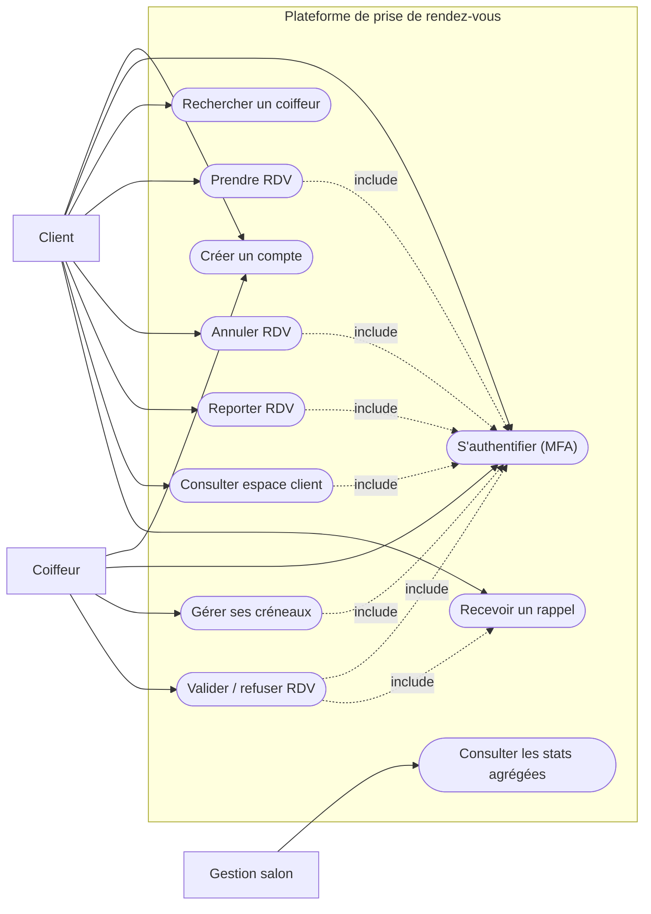
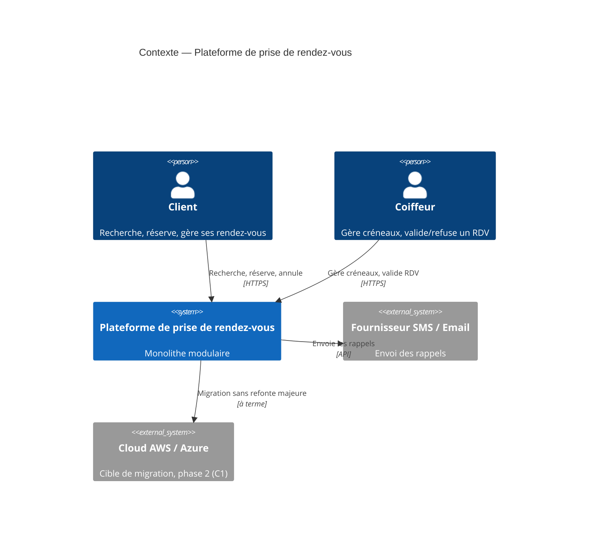
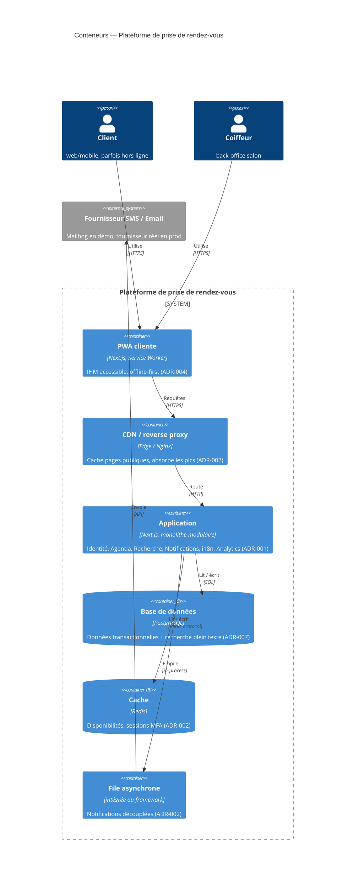
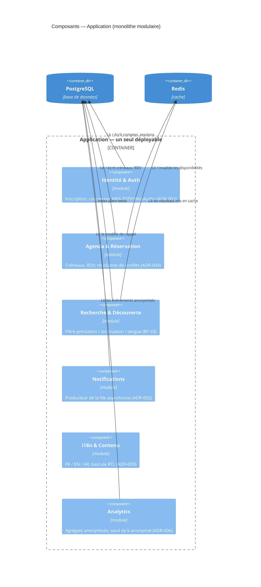
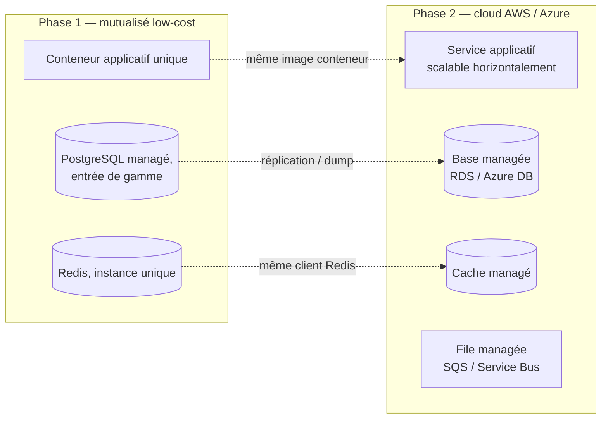
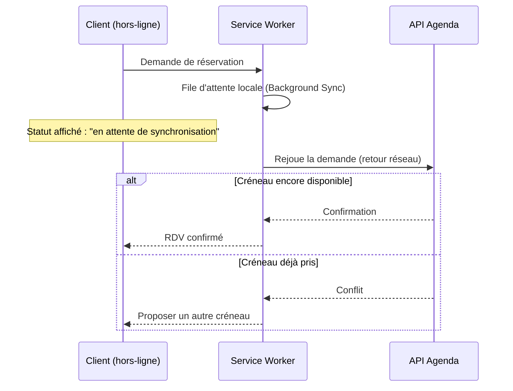

# Dossier d'architecture logicielle

**Plateforme web de prise de rendez-vous en salon de coiffure**

> Livrable principal du projet. Ce document compile et synthétise les quatre artefacts de travail du
> repository — [plan-architecture.md](../plan-architecture.md), [adr/](../adr/README.md),
> [bf/besoins-fonctionnels.md](../bf/besoins-fonctionnels.md),
> [pu/parcours-utilisateur.md](../pu/parcours-utilisateur.md) — en un seul dossier soumissible. Chaque
> section renvoie vers le document source pour le détail complet ; ce qui est reproduit ici (diagrammes,
> synthèses) l'est pour que le dossier reste lisible de façon autonome.

---

## 1. Objectif et contexte métier

Concevoir l'architecture logicielle d'une plateforme web de prise de rendez-vous en salon de coiffure,
destinée au grand public, intégrant accessibilité numérique, performance, expérience utilisateur et
adaptabilité aux besoins métier.

Le projet répond au besoin d'une **chaîne régionale de salons de coiffure** : réduire les files d'attente et
améliorer l'accès aux coiffeurs, y compris pour les personnes en situation de handicap. Ce dernier point
n'est pas une fonctionnalité parmi d'autres : il conditionne des choix d'architecture à part entière (T3,
section 4) — cf. [architecture-logicielle-projet_1.md](../architecture-logicielle-projet_1.md) pour le brief
d'origine.

---

## 2. Expression des besoins

### 2.1 Besoins fonctionnels

Neuf besoins exprimés dans le brief (F1–F9), traduits en 13 besoins fonctionnels détaillés et testables
(BF-01 à BF-13, dont BF-02 et BF-13 rendent explicites deux besoins implicites du brief — authentification et
tableau de bord statistique). Détail complet, critères d'acceptation et matrice de traçabilité :
[bf/besoins-fonctionnels.md](../bf/besoins-fonctionnels.md).

| Priorité | BF |
|---|---|
| **Essentiel** (cœur du parcours de réservation) | BF-01 Création de compte, BF-02 Authentification, BF-03 Recherche, BF-04 Prise de RDV, BF-08 Espace client, BF-09 Gestion des créneaux, BF-10 Validation/refus RDV |
| **Important** (requis par le brief) | BF-05 Annulation, BF-06 Report, BF-07 Notification de rappel, BF-11 Multilingue/RTL |
| **Souhaitable** (valeur ajoutée) | BF-12 Assistance accessible, BF-13 Tableau de bord statistique |

### 2.2 Besoins non fonctionnels (contraintes)

Sept contraintes du brief, relues comme exigences d'architecture :

| ID | Contrainte | Ce qu'elle exige |
|----|------------|-------------------|
| C1 | Déploiement | Mutualisé low-cost aujourd'hui, cloud (AWS/Azure) demain, sans refonte majeure. |
| C2 | Performance | 500 utilisateurs simultanés en pic, temps de réponse < 2s. |
| C3 | Sécurité + accessibilité | MFA, entièrement utilisable au clavier pour les malvoyants. |
| C4 | Qualité dégradée | Fonctionne en coupure réseau / faible bande passante (zone rurale). |
| C5 | Localisation | FR / EN / AR, avec adaptation du sens de lecture (RTL). |
| C6 | Analyse métier | Statistiques agrégées sans exposer d'informations personnelles. |
| C7 | Maintenance | Équipe de 3 personnes, minimum de dépendances techniques. |

C7 borne toutes les autres réponses : c'est le fil rouge des heuristiques retenues en section 4.

---

## 3. Parcours utilisateur

Quatre personas, dont trois suivent délibérément le **même parcours client** (la variation porte sur ce qui
se passe *à l'intérieur* de chaque étape, pas sur les étapes elles-mêmes — pour ne pas recréer la duplication
qu'[ADR-005](../adr/0005-i18n-rtl.md) évite déjà pour les langues) :

| Persona | Contraintes dominantes |
|---|---|
| Client urbain (usage nominal) | C2 |
| Client en zone rurale (connectivité intermittente) | C4 |
| Client malvoyant (navigation clavier / lecteur d'écran) | C3 |
| Coiffeur (back-office salon) | C2, C4 |

Deux variantes explicitement couvertes : **réseau dégradé** (le squelette du parcours ne change pas, les
étapes de réservation basculent en mode « provisoire » jusqu'à synchronisation — ADR-004) et **navigation
clavier / lecteur d'écran** (l'authentification MFA et l'assistance sont les points de risque de blocage les
plus élevés — ADR-003). Détail pas à pas des deux variantes, et parcours professionnel complet :
[pu/parcours-utilisateur.md](../pu/parcours-utilisateur.md).

---

## 4. Choix d'architecture — heuristiques et compromis

Chaque tension ci-dessous confronte deux attributs de qualité en conflit direct et documente l'heuristique
retenue ainsi que le compromis explicitement assumé en échange. Détail complet (options comparées,
conséquences, conditions de révision) dans chaque ADR référencée.

| # | Tension | Attributs en conflit | Heuristique retenue | ADR |
|---|---------|----------------------|----------------------|-----|
| T1 | Sobriété d'hébergement vs trajectoire cloud (C1, C7) | Scalabilité/Élasticité vs Déployabilité/Maintenabilité/Faisabilité | Monolithe modulaire 12-factor, une image de conteneur unique | [ADR-001](../adr/0001-monolithe-modulaire.md) |
| T2 | Performance sous charge vs budget d'infra (C2, C1) | Performance/Disponibilité vs Faisabilité | CDN + cache Redis + traitement asynchrone des tâches non critiques | [ADR-002](../adr/0002-cache-cdn-async.md) |
| T3 | Authentification forte vs accessibilité clavier (C3) | Sécurité vs Utilisabilité | WebAuthn/passkey en principal, TOTP en repli, jamais de mécanisme souris-seule | [ADR-003](../adr/0003-mfa-accessible.md) |
| T4 | Continuité réseau dégradé vs cohérence de l'agenda (C4, F3) | Disponibilité vs Fiabilité | PWA offline-first, file de réservation rejouée à la reconnexion, confirmation serveur qui fait foi | [ADR-004](../adr/0004-pwa-offline-first.md) |
| T5 | Richesse linguistique (FR/EN/AR) vs équipe réduite (C5, C7) | Utilisabilité vs Maintenabilité/Faisabilité | CSS logique + i18n par clés, RTL = bascule d'attribut, pas une réécriture | [ADR-005](../adr/0005-i18n-rtl.md) |
| T6 | Valeur analytique vs protection des données (C6) | Utilisabilité vs Sécurité | Anonymisation à la source, seuil de k-anonymat | [ADR-006](../adr/0006-anonymisation-analytics.md) |
| T7 | Ambition fonctionnelle vs capacité d'équipe (C7, transverse) | Agilité vs Maintenabilité/Faisabilité | Toute nouvelle capacité s'appuie sur une brique déjà choisie, jamais une brique de plus | [ADR-007](../adr/0007-socle-technique-restreint.md) |

Statut : toutes les ADR sont **Proposées** — base de travail validée en équipe, révisables dès qu'un compromis
cesse d'être acceptable (chaque ADR porte sa propre condition de révision mesurable).

---

## 5. Diagrammes

### 5.1 Diagramme de cas d'utilisation

### 5.2 C4 — Contexte

### 5.3 C4 — Conteneurs

### 5.4 C4 — Composants (zoom sur « Application »)

### 5.5 Diagramme de déploiement (deux phases)

### 5.6 Séquence — réservation en réseau dégradé (T4)

Diagrammes source et contexte narratif complet : [plan-architecture.md](../plan-architecture.md#3-vue-darchitecture).

---

## 6. Socle technique

| Rôle | Choix | Justification |
|------|-------|----------------|
| Client | Next.js (SSR + PWA) | Performance perçue et accessibilité (T2, T3), service worker pour le mode dégradé (T4), i18n intégré (C5). |
| Application | Monolithe modulaire, un seul langage front/back (TypeScript) | Limite le nombre de compétences à couvrir par 3 personnes (T7). |
| Données | PostgreSQL | Intégrité pour éviter le double-réservation (T4), recherche plein texte intégrée — évite un moteur dédié (T7). |
| Cache / sessions | Redis | Disponibilités de créneaux et sessions MFA en lecture rapide (T2). |
| Tâches asynchrones | File intégrée au framework | Découple les notifications du chemin critique (T2), migrable vers un service managé en phase 2. |
| Frontal réseau | CDN / reverse proxy | Cache des pages publiques, absorption des pics (T2), compatible mutualisé. |
| SMS / email | Fournisseur tiers derrière une interface (Mailhog en démo) | Le module Notifications ne connaît qu'un contrat interne (T7). |
| Authentification | TOTP fonctionnel, WebAuthn documenté comme cible | Méthodes MFA testées accessibles au clavier/lecteur d'écran (T3). |

---

## 7. Justification face aux besoins métier

- **Réduire les files d'attente** (besoin métier premier) : recherche en cache + réservation en ligne < 2s
  (T2) transforment un appel téléphonique en self-service, y compris en pic saisonnier (500 utilisateurs
  simultanés visé par C2).
- **Accès inclusif, y compris personnes en situation de handicap** : ce n'est pas traité comme un écran
  isolé mais comme une contrainte transverse (T3) qui façonne le choix même du mécanisme MFA — un MFA «
  standard » aurait exclu une partie du public cible, donc échoué le besoin métier plutôt que juste la
  conformité RGAA.
- **Zone rurale desservie par la chaîne** : C4 n'est pas une fonctionnalité secondaire mais une des sept
  contraintes fondatrices — le mode dégradé (T4) garantit que la plateforme reste utilisable là où la chaîne
  a justement le plus besoin qu'elle le soit.
- **Croissance vers le cloud sans refonte** (C1) : le monolithe modulaire (T1) n'est pas un choix par défaut
  mais le compromis qui permet à la chaîne de démarrer petit (hébergement mutualisé, budget contraint) sans
  s'interdire la bascule cloud quand le volume le justifiera.
- **Équipe de maintenance réduite** (C7, T7) : chaque heuristique T1–T6 a été choisie en réutilisant une
  brique déjà retenue plutôt qu'en ajoutant un composant de plus — condition de viabilité à long terme pour
  une chaîne qui n'a pas vocation à opérer une plateforme complexe.

---

## 8. Autres livrables du projet

| Livrable | Emplacement | Statut |
|---|---|---|
| Dossier d'architecture logicielle (ce document) | `dossier/dossier-architecture-logicielle.md` | Réalisé |
| Rapport d'analyse de performance | `performance/rapport-performance.md` | À produire (phase 3 du plan d'exécution) |
| Rapport d'accessibilité RGAA 4 | `accessibilite/rapport-rgaa.md` | À produire (phase 4) |
| Présentation de soutenance | `soutenance/presentation.md` | À produire (phase 5) |
| Prototype fonctionnel (`docker-compose`) | `prototype/` + `docker-compose.yml` | En cours (phase 2) |
