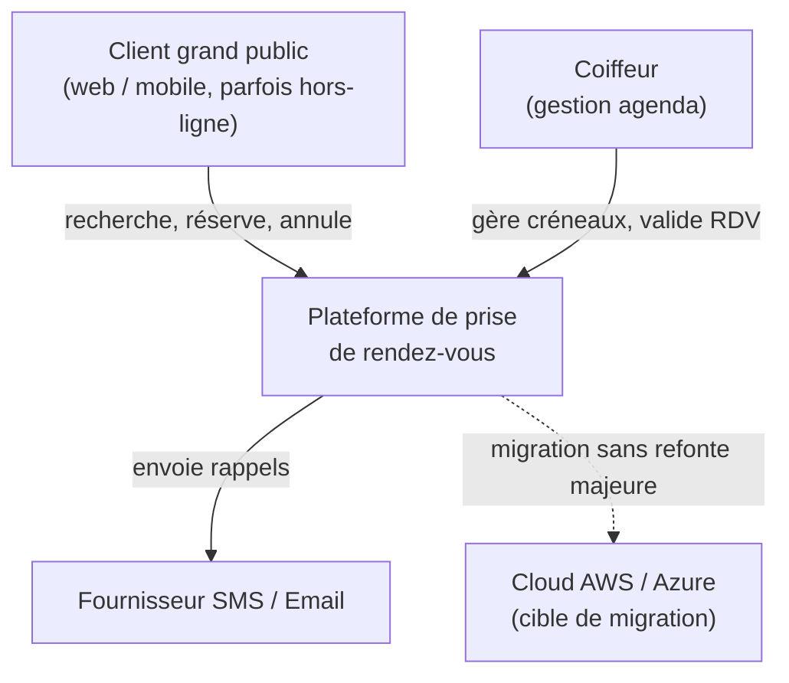
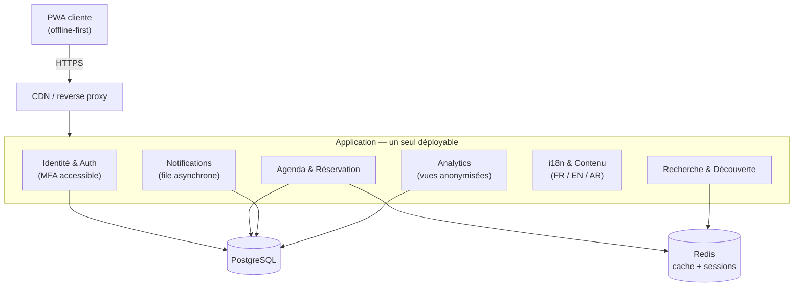
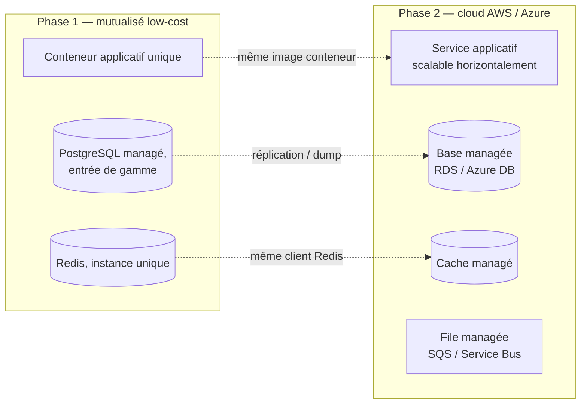
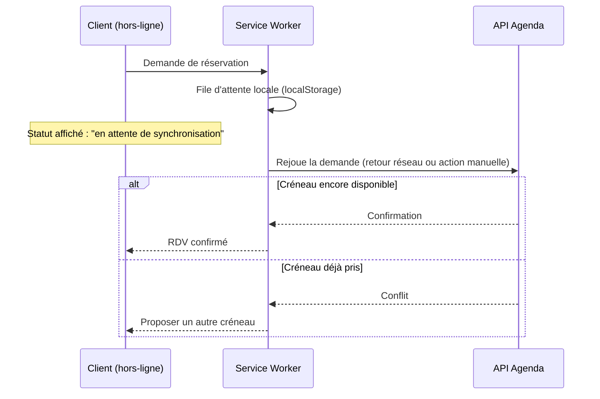
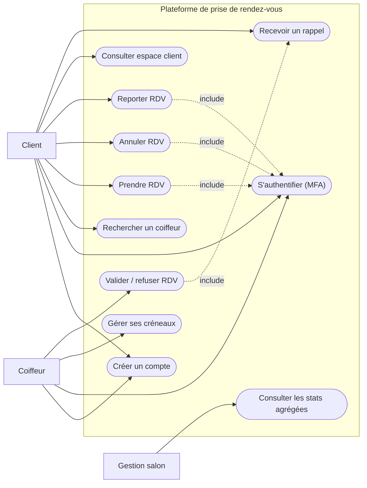
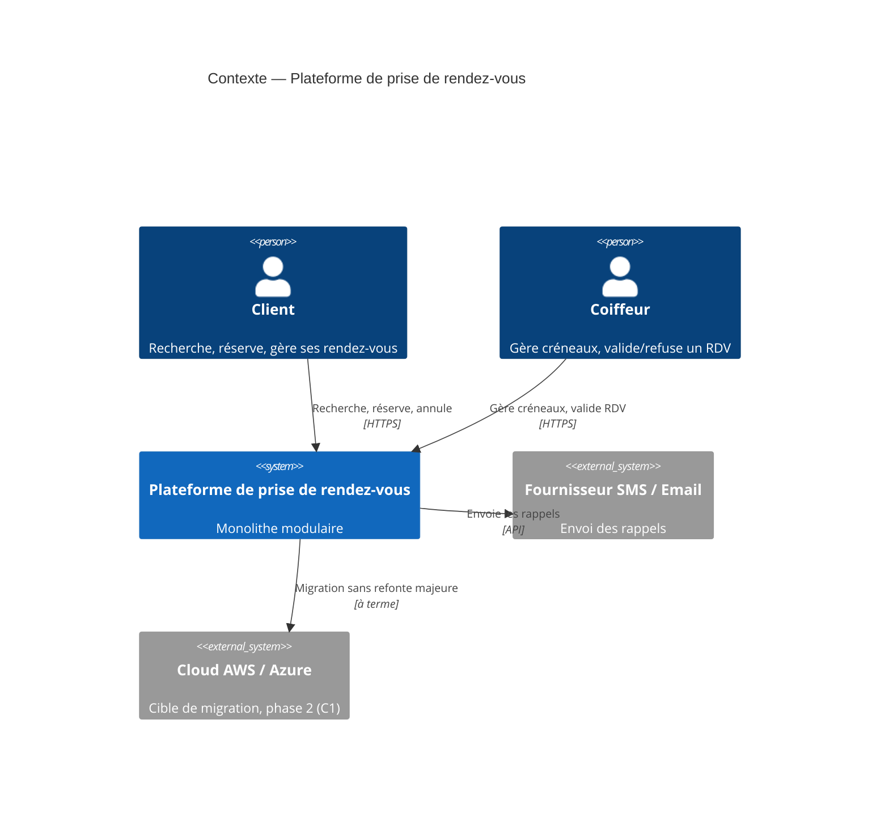
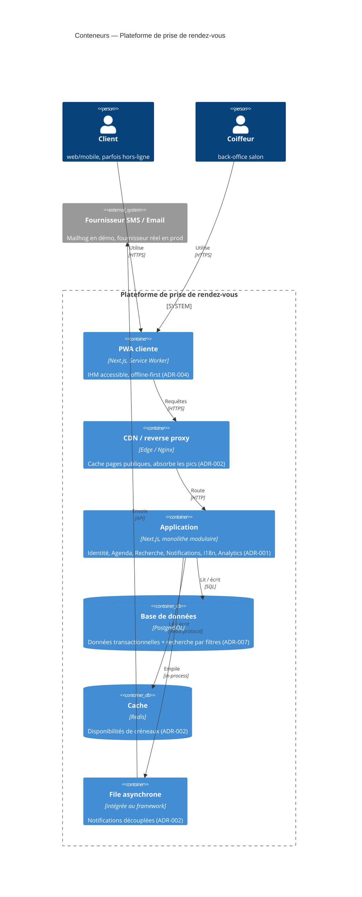
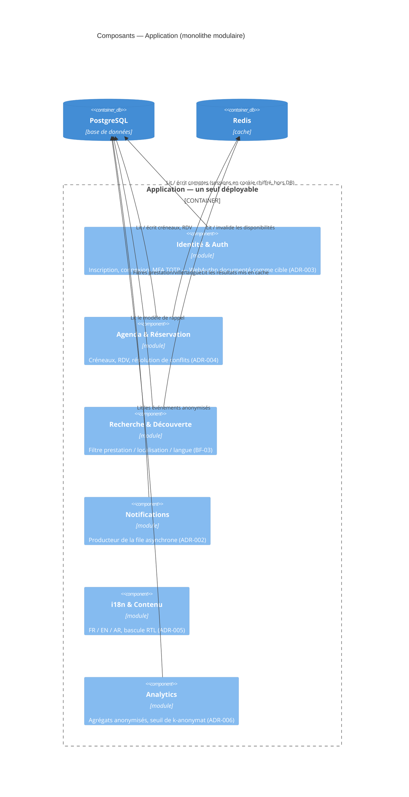

# Plan d'architecture — Plateforme de prise de rendez-vous en salon de coiffure

> Note de cadrage produite à partir de `architecture-logicielle-projet_1.md`.
> Version consultable avec diagrammes : voir l'artefact publié dans la conversation.
> Décisions détaillées : [adr/](adr/README.md). Besoins fonctionnels détaillés : [bf/besoins-fonctionnels.md](bf/besoins-fonctionnels.md).
> Parcours utilisateur détaillé : [pu/parcours-utilisateur.md](pu/parcours-utilisateur.md).

## 1. Lecture des contraintes

| ID | Contrainte | Ce qu'elle exige |
|----|------------|-------------------|
| C1 | Déploiement | Mutualisé low-cost aujourd'hui, cloud (AWS/Azure) demain, sans refonte majeure. |
| C2 | Performance | 500 utilisateurs simultanés en pic, temps de réponse < 2s. |
| C3 | Sécurité + accessibilité | MFA, entièrement utilisable au clavier pour les malvoyants. |
| C4 | Qualité dégradée | Fonctionne en coupure réseau / faible bande passante (zone rurale). |
| C5 | Localisation | FR / EN / AR, avec adaptation du sens de lecture (RTL). |
| C6 | Analyse métier | Statistiques agrégées sans exposer d'informations personnelles. |
| C7 | Maintenance | Équipe de 3 personnes, minimum de dépendances techniques. |

C7 borne toutes les autres réponses : c'est le fil rouge de la section 2.

## 2. Tensions architecturales et heuristiques retenues

> Chaque tension ci-dessous est développée en ADR complet (options comparées, conséquences, conditions de
> révision) dans [adr/](adr/README.md).

> **Vocabulaire des attributs de qualité** (caractéristiques architecturales) utilisé pour nommer les oppositions T1–T7 :
> Agilité, Fiabilité, Scalabilité, Faisabilité, Déployabilité, Utilisabilité, Élasticité, Testabilité, Performance,
> Sécurité, Disponibilité, Maintenabilité. Chaque caractéristique que le système doit prendre en charge ajoute de la
> complexité à sa conception — c'est cette friction, propre à chaque tension, qui motive l'heuristique retenue.

### T1 — Sobriété d'hébergement vs trajectoire cloud (C1, C7)
- **Tension** : microservices/Kubernetes = meilleure scalabilité indépendante, mais hors de portée d'un mutualisé bon marché et d'une équipe de 3 personnes ; coder pour un mutualisé « classique » risque une refonte à la migration.
- **Attributs de qualité en tension** : **Scalabilité** / **Élasticité** (montée en charge indépendante par service) *vs* **Déployabilité** / **Maintenabilité** / **Faisabilité** (un seul artefact à opérer, équipe de 3, hébergement mutualisé).
- **Heuristique retenue** : monolithe modulaire 12-factor (modules à bornes claires : Identité, Agenda, Recherche, Notifications, i18n, Analytics), sans état, config par variables d'environnement, empaqueté en une image de conteneur unique dès le développement.
- **Compromis assumé** : pas d'isolation ni de scaling indépendant par module — acceptable au volume visé (500 utilisateurs en pic).

### T2 — Performance sous charge vs budget d'infrastructure (C2, C1)
- **Tension** : tenir < 2s à 500 utilisateurs simultanés sur un mutualisé peu coûteux, sans sur-dimensionner.
- **Attributs de qualité en tension** : **Performance** / **Disponibilité** (tenir la charge de pointe) *vs* **Faisabilité** (budget d'infrastructure mutualisé, pas de sur-provisionnement).
- **Heuristique retenue** : CDN/reverse-proxy en frontal, cache applicatif (Redis) sur les disponibilités de créneaux, traitement asynchrone des tâches non critiques (SMS/email en file).
- **Compromis assumé** : notifications non strictement synchrones (délai de quelques secondes) — sans impact métier.
- **Constat de test de charge** : les tests k6 ont révélé un dépassement réel du seuil de 2s (p95 jusqu'à ~3,4s), causé non par le cache mais par un plafond CPU (hachage `scrypt` synchrone). Corrigé par un hachage asynchrone puis une exécution en cluster Node (`prototype/server.js`), ramenant le p95 à ~1,3s. Détail complet dans [ADR-002](adr/0002-cache-cdn-async.md) (§ Constats) et `performance/rapport-performance.md`.

### T3 — Authentification forte vs accessibilité clavier (C3)
- **Tension** : la plupart des MFA du marché (QR code, CAPTCHA visuel) sont inutilisables au clavier seul par une personne malvoyante.
- **Attributs de qualité en tension** : **Sécurité** (authentification forte, MFA) *vs* **Utilisabilité** (parcours 100% clavier/lecteur d'écran).
- **Heuristique retenue** : WebAuthn/passkeys en méthode principale, TOTP saisi manuellement en repli, SMS en dernier recours ; aucun mécanisme reposant uniquement sur souris/vision. Parcours validé Tab/Entrée, focus visible, erreurs en zone ARIA live.
- **Compromis assumé** : développement du flux d'authentification plus long qu'une solution MFA « clé en main » non accessible.
- **État d'implémentation (prototype)** : TOTP est le mécanisme MFA fonctionnel et testé. WebAuthn/passkey et le repli SMS restent des cibles documentées par cette ADR, non construites dans ce prototype (voir `prototype/README.md`) — TOTP seul satisfait déjà l'exigence C3 (MFA accessible au clavier), mais sans le gain de résistance au phishing propre à WebAuthn.

### T4 — Continuité réseau dégradé vs cohérence de l'agenda (C4, F3)
- **Tension** : un agenda synchronisé suppose en général une confirmation serveur immédiate, impossible à garantir en zone rurale/faible bande passante.
- **Attributs de qualité en tension** : **Disponibilité** (fonctionner en coupure réseau / faible bande passante) *vs* **Fiabilité** (cohérence de l'agenda, pas de double-réservation).
- **Heuristique retenue** : PWA offline-first — coquille et RDV du client en cache local, actions de réservation mises en file (Background Sync) et rejouées à la reconnexion, confirmation serveur qui fait foi en cas de conflit.
- **Compromis assumé** : une réservation hors-ligne reste « provisoire » et peut échouer — l'IHM doit l'afficher explicitement.
- **État d'implémentation (prototype)** : la file locale est gérée en `localStorage` (pas via l'API Background Sync, non retenue en raison d'un support navigateur inégal hors Chromium) et rejouée sur l'événement `online` ou sur action manuelle (« Synchroniser maintenant ») pendant que l'application est ouverte — voir `prototype/README.md`. Limite assumée : sans Background Sync, une resynchronisation ne se déclenche pas automatiquement si l'utilisateur rouvre l'application après le retour du réseau ; il doit relancer la synchronisation manuellement.

### T5 — Richesse linguistique (FR/EN/AR) vs équipe réduite (C5, C7)
- **Tension** : trois langues dont une RTL peuvent imposer trois gabarits à maintenir en parallèle.
- **Attributs de qualité en tension** : **Utilisabilité** (FR/EN/AR, adaptation RTL) *vs* **Maintenabilité** / **Faisabilité** (trois gabarits à maintenir avec une équipe de 3 personnes).
- **Heuristique retenue** : propriétés CSS logiques dès la première maquette, moteur i18n à base de clés (ICU), traductions traitées comme données externalisées. RTL = bascule d'attribut `dir="rtl"`, pas une réécriture.
- **Compromis assumé** : discipline CSS stricte à imposer dès le départ (interdiction de left/right physiques).

### T6 — Valeur analytique vs protection des données (C6)
- **Tension** : le métier veut des statistiques, le brief interdit d'exposer des données personnelles dans les agrégats.
- **Attributs de qualité en tension** : **Utilisabilité** (valeur exploitable des statistiques pour le métier) *vs* **Sécurité** (anonymisation, protection des données personnelles, conformité RGPD).
- **Heuristique retenue** : flux d'événements anonymisés (prestation, salon, créneau arrondi — jamais nom/email/téléphone) vers un espace de reporting séparé, seuil de k-anonymat (agrégats < 5 occurrences non restitués).
- **Compromis assumé** : pas d'analyse fine par client individuel, en échange d'une conformité RGPD by design opérable sans DPO dédié.

### T7 (méta-tension) — Ambition fonctionnelle vs capacité d'équipe (C7, transverse)
- **Tension** : chaque contrainte tire vers un composant technique supplémentaire ; cumulés, ils dépassent ce que 3 personnes peuvent exploiter durablement.
- **Attributs de qualité en tension** : **Agilité** (capacité à ajouter de nouvelles caractéristiques — Scalabilité, Élasticité, Performance, Sécurité, Disponibilité, Testabilité…) *vs* **Maintenabilité** / **Faisabilité** (ce qu'une équipe de 3 personnes peut opérer durablement). C'est la tension chapeau : chaque caractéristique ajoutée par T1–T6 alimente ce même arbitrage transverse.
- **Heuristique retenue** : toute nouvelle capacité s'appuie sur une brique déjà choisie (un seul SGBD, un seul cache, une seule file, un seul hébergeur) ; chaque écart documenté en ADR.
- **Compromis assumé** : renoncer à la solution « idéale » pièce par pièce (ex. Elasticsearch) au profit d'une solution suffisante (index PostgreSQL).

## 3. Vue d'architecture

**État d'implémentation (prototype)** : la resynchronisation est déclenchée par l'événement navigateur
`online` ou par une action manuelle (« Synchroniser maintenant »), tant que l'application est ouverte —
pas par l'API Background Sync (support navigateur inégal hors Chromium, non retenue). Conséquence assumée :
si l'utilisateur rouvre l'application après le retour du réseau sans avoir eu l'app ouverte pendant la
transition, la synchronisation doit être relancée manuellement.

### Diagramme de cas d'utilisation

Les cas d'utilisation renvoient chacun à un besoin fonctionnel détaillé dans
[bf/besoins-fonctionnels.md](bf/besoins-fonctionnels.md) (BF-01 à BF-13) ; les inclusions (`include`)
matérialisent les garde-fous transverses (T3 : pas de réservation/annulation/report sans authentification
MFA déjà posée ; validation d'un RDV déclenche systématiquement une notification, T2/T7).

### Diagrammes C4

**Niveau 1 — Contexte**

**Niveau 2 — Conteneurs**

**Niveau 3 — Composants (zoom sur le conteneur « Application »)**

Les frontières de composants ci-dessus correspondent directement à l'arborescence `prototype/src/` du
prototype (livrable 5) : un module = un dossier, pas de couplage caché entre modules — c'est la condition
posée par [ADR-001](adr/0001-monolithe-modulaire.md) pour qu'une future extraction en service séparé reste
possible sans refonte majeure (T1).

## 4. Socle technique proposé

| Rôle | Choix | Justification |
|------|-------|----------------|
| Client | Framework SSR + PWA | Performance perçue et accessibilité (T2, T3), service worker pour le mode dégradé (T4), i18n intégré (C5). |
| Application | Monolithe modulaire, un seul langage front/back | Limite le nombre de compétences à couvrir par 3 personnes (T7). |
| Données | PostgreSQL | Intégrité pour éviter le double-réservation (T4), recherche par filtres applicatifs (prestation/ville/langue) — évite un moteur dédié (T7). Un index plein texte PostgreSQL (`tsvector`/GIN) reste une piste d'amélioration si le nombre de salons croît significativement. |
| Cache | Redis | Disponibilités de créneaux en lecture rapide (T2). Les sessions utilisateur sont gérées via cookie chiffré (`iron-session`), sans dépendance à Redis. |
| Tâches asynchrones | File intégrée au framework | Découple les notifications du chemin critique (T2), migrable vers un service managé en phase 2. Dans le prototype, ce traitement est non-bloquant (fire-and-forget) plutôt qu'une file avec ordonnancement/retry persistant. |
| Frontal réseau | CDN / reverse proxy | Cache des pages publiques, absorption des pics (T2), compatible mutualisé. |
| SMS / email | Fournisseur tiers derrière une interface | Le module Notifications ne connaît qu'un contrat interne (T7). |
| Authentification | TOTP fonctionnel ; WebAuthn documenté comme cible | Seule méthode MFA testée et livrée, accessible au clavier/lecteur d'écran (T3) ; WebAuthn (résistance au phishing) et le repli SMS restent à construire. |

## 5. Plan de réalisation des livrables

1. **Semaine 1 — Cadrage** : besoins non-fonctionnels, personas (client, coiffeur, utilisateur malvoyant au clavier), parcours nominal et dégradé.
2. **Semaine 2 — Décisions d'architecture** : ADR complets pour T1–T7, diagrammes C4 (contexte/conteneurs), diagramme de cas d'utilisation, diagramme de déploiement à deux phases.
3. **Semaine 3 — Performance** : scénario critique (ouverture de créneaux, 500 utilisateurs), plan de test de charge (k6/Locust), optimisations, rapport avec hypothèses de dimensionnement.
4. **Semaines 3–4 — Accessibilité** : audit RGAA 4 partiel sur 2 écrans clés (recherche, formulaire de RDV avec MFA), non-conformités et corrections consignées.
5. **Semaine 4 — Prototype** : maquette fonctionnelle packagée en `docker-compose`, démontrant le parcours clavier complet (recherche, authentification MFA, réservation, espace client), le mode dégradé et la bascule RTL.
6. **Semaine 5 — Soutenance** : présentation construite autour de T1–T7 comme fil narratif.

## 6. Risques résiduels

- **RTL tardif** — tester `dir="rtl"` dès la phase 2, pas en phase 4, pour éviter des régressions visuelles coûteuses en fin de projet.
- **Portabilité cloud** — valider dès la phase 2 que l'image conteneur tourne à l'identique en local et sur l'hébergeur cible, avant d'écrire la moindre fonctionnalité métier.
- **MFA non accessible** — test manuel lecteur d'écran (NVDA/VoiceOver) sur le parcours d'authentification avant la fin de la phase 2.
- **Charge non mesurée** — prévoir une file d'attente virtuelle (« salle d'attente ») si le pic dépasse la capacité mesurée, plutôt qu'un sur-provisionnement permanent.

---

Ce document propose un cadrage argumenté, pas une décision figée : chaque heuristique (T1–T7) reste révisable dès qu'un compromis cesse d'être acceptable — c'est précisément ce qu'un ADR est fait pour documenter.
