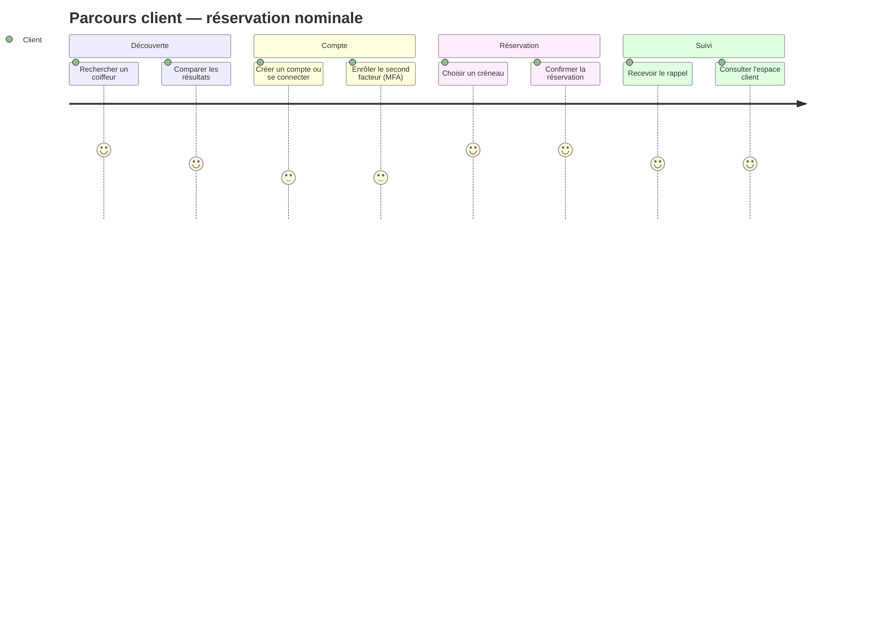
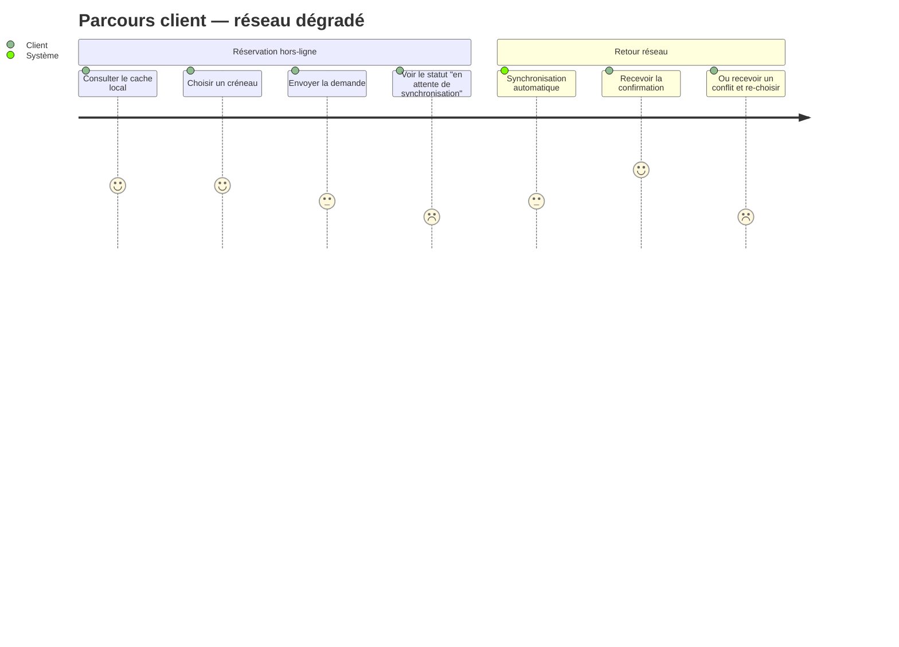

# Parcours utilisateur

Explicite le parcours type de chaque acteur de la plateforme, en situation nominale puis dans les deux
variantes que le brief impose explicitement : réseau dégradé (C4) et navigation clavier / lecteur d'écran
(C3). Chaque étape renvoie vers le besoin fonctionnel ([bf/besoins-fonctionnels.md](../bf/besoins-fonctionnels.md))
et la décision d'architecture ([adr/](../adr/README.md)) qui la rendent possible.

---

## 1. Personas

| Persona | Profil | Contraintes dominantes |
|---|---|---|
| **Client urbain** | Usage nominal, connexion stable, aucun besoin d'assistance particulier | C2 |
| **Client en zone rurale** | Connectivité intermittente ou faible bande passante | C4 |
| **Client malvoyant** | Navigation exclusivement au clavier, lecteur d'écran | C3 |
| **Coiffeur (professionnel)** | Gère ses créneaux et les demandes entrantes depuis le salon | C2, C4 |

Les trois premiers personas suivent le **même parcours client** : la variation ne porte pas sur les étapes
mais sur ce qui se passe *à l'intérieur* de chaque étape. C'est délibéré — concevoir trois parcours
différents aurait recréé la duplication que [ADR-005](../adr/0005-i18n-rtl.md) évite déjà pour les langues.

---

## 2. Parcours client — nominal

| # | Étape | Action utilisateur | Réponse système | BF | Contraintes actives |
|---|-------|---------------------|------------------|----|-----|
| 1 | Recherche | Saisit une prestation, une localisation, une langue | Retourne une liste de coiffeurs correspondants en < 2s | [BF-03](../bf/besoins-fonctionnels.md#bf-03) | C2, C5 |
| 2 | Compte / connexion | Crée un compte (1ʳᵉ visite) ou se connecte (retour) | Demande un second facteur (WebAuthn en priorité) | [BF-01](../bf/besoins-fonctionnels.md#bf-01), [BF-02](../bf/besoins-fonctionnels.md#bf-02) | C3 |
| 3 | Réservation | Choisit un créneau disponible et confirme | Confirme la réservation en < 2s, verrouille le créneau | [BF-04](../bf/besoins-fonctionnels.md#bf-04) | C2 |
| 4 | Confirmation | — | Envoie un accusé de réservation puis, en tâche de fond, l'email/SMS de confirmation | [BF-04](../bf/besoins-fonctionnels.md#bf-04), [BF-07](../bf/besoins-fonctionnels.md#bf-07) | C2 |
| 5 | Espace client | Consulte ses rendez-vous à venir | Affiche le rendez-vous confirmé dans la liste | [BF-08](../bf/besoins-fonctionnels.md#bf-08) | — |
| 6 | Rappel | — | Envoie un rappel par email/SMS un délai avant le rendez-vous | [BF-07](../bf/besoins-fonctionnels.md#bf-07) | C2, C7 |
| 7 | Modification (option) | Annule ou reporte le rendez-vous | Libère ou déplace le créneau, notifie le coiffeur | [BF-05](../bf/besoins-fonctionnels.md#bf-05), [BF-06](../bf/besoins-fonctionnels.md#bf-06) | C4 |

---

## 3. Variante réseau dégradé (zone rurale, C4)

Le squelette du parcours ne change pas — c'est le principe retenu en [ADR-004](../adr/0004-pwa-offline-first.md).
Ce qui change : les étapes 1, 3 et 4 basculent en mode « provisoire » tant que la connexion n'est pas
rétablie.

| Étape du parcours nominal | Comportement en réseau dégradé | Référence |
|---|---|---|
| 1. Recherche | Les derniers résultats consultés restent affichables en lecture seule depuis le cache local | [ADR-004](../adr/0004-pwa-offline-first.md) |
| 3. Réservation | La demande est mise en file locale (Background Sync) au lieu d'échouer ; l'IHM affiche « en attente de synchronisation », jamais « confirmé » | [BF-04](../bf/besoins-fonctionnels.md#bf-04), [ADR-004](../adr/0004-pwa-offline-first.md) |
| 4. Confirmation | Rejouée automatiquement au retour du réseau. Deux issues possibles : créneau toujours libre → confirmation ; créneau pris entre-temps → conflit, un autre créneau est proposé | [ADR-004](../adr/0004-pwa-offline-first.md) (diagramme de séquence détaillé dans [plan-architecture.md](../plan-architecture.md#t4)) |
| 5. Espace client | Les rendez-vous « en attente de synchronisation » sont visuellement distingués des rendez-vous confirmés | [BF-08](../bf/besoins-fonctionnels.md#bf-08) |

Point de vigilance transporté depuis le [plan d'architecture](../plan-architecture.md#6-risques-résiduels) :
l'état « en attente » doit être conçu comme un état de première classe de l'IHM, pas comme une exception —
c'est l'écart le plus probable entre une démonstration en ligne et un usage réel en zone rurale.

---

## 4. Variante navigation clavier / lecteur d'écran (C3)

Même parcours nominal, rejoué sans souris. Les étapes 2 (authentification) et l'accès à l'assistance sont
celles où le risque de blocage est le plus élevé — ce sont aussi les deux écrans retenus pour l'audit RGAA
partiel (phase 4 du [plan de réalisation](../plan-architecture.md#5-plan-de-réalisation-des-livrables)).

| Étape | Ce qui doit fonctionner au clavier seul | Référence |
|---|---|---|
| 1. Recherche | Champs de filtre atteignables par Tab, résultats annoncés par le lecteur d'écran sans rechargement silencieux de page | [BF-03](../bf/besoins-fonctionnels.md#bf-03) |
| 2. Compte / connexion | Enrôlement et vérification MFA entièrement au clavier ; jamais de QR code ou de CAPTCHA visuel comme unique option ; focus visible à chaque étape ; erreurs portées par une zone ARIA live | [BF-01](../bf/besoins-fonctionnels.md#bf-01), [BF-02](../bf/besoins-fonctionnels.md#bf-02), [ADR-003](../adr/0003-mfa-accessible.md) |
| 3. Réservation | Sélection de créneau navigable comme une liste, pas comme une grille dépendant du pointage souris | [BF-04](../bf/besoins-fonctionnels.md#bf-04) |
| À tout moment | Assistant accessible activable au clavier, sans piège de focus (« keyboard trap ») | [BF-12](../bf/besoins-fonctionnels.md#bf-12) |

---

## 5. Parcours professionnel (coiffeur)

Parcours secondaire, plus court, côté back-office du salon.

| # | Étape | Action utilisateur | Réponse système | BF |
|---|-------|---------------------|------------------|----|
| 1 | Connexion | Se connecte avec MFA | Ouvre le tableau de bord des créneaux | [BF-02](../bf/besoins-fonctionnels.md#bf-02) |
| 2 | Gestion des créneaux | Définit ou modifie ses disponibilités | Invalide immédiatement le cache de recherche concerné | [BF-09](../bf/besoins-fonctionnels.md#bf-09) |
| 3 | Réception d'une demande | — | Notifie le coiffeur d'une nouvelle demande de rendez-vous | [BF-07](../bf/besoins-fonctionnels.md#bf-07) |
| 4 | Validation / refus | Valide ou refuse la demande | Notifie le client du résultat | [BF-10](../bf/besoins-fonctionnels.md#bf-10) |

---

## 6. Synthèse — couverture des livrables

| Écran / parcours | Utilisé pour |
|---|---|
| Recherche (étape 1) + Formulaire de connexion avec MFA (étape 2) | Écrans retenus pour l'audit RGAA 4 partiel (phase 4 du plan) |
| Réservation en réseau dégradé (section 3) | Scénario de démonstration du prototype `docker-compose` (phase 5 du plan) |
| Parcours nominal complet (section 2) | Trame narrative de la soutenance, aux côtés des tensions T1–T7 |

Ce document ferme la boucle entre les trois artefacts : le [plan d'architecture](../plan-architecture.md)
pose les tensions, les [ADR](../adr/README.md) tranchent chacune, les
[besoins fonctionnels](../bf/besoins-fonctionnels.md) les rendent testables, et ce parcours utilisateur
montre ce que l'utilisateur vit réellement à chaque étape — y compris quand tout ne se passe pas comme prévu.
